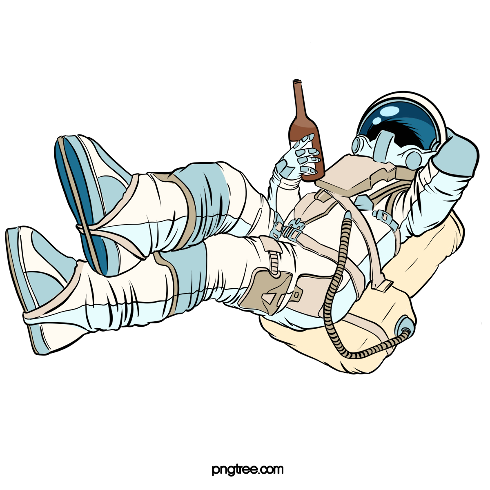

<h1 align="center">
  

  :satellite:<p> Voce nao vai decorar tudo. E nem precisa!
</h1>

#  :cloud: :computer:About
  Criei esse repositorio  para usar como consulta, dos fundamentos  aprendidos em javascript, EMCA para backend com nodejs

## :hammer:Tools
- [node](https://nodejs.org/en/docs/)
- [typescript](https://www.typescriptlang.org/docs/)
- [javascript](https://developer.mozilla.org/en-US/docs/Web/JavaScript) 

## :recycle: Como Contribuir
```bash
#clone o projeto

$ git clone https://github.com/deivid94/javascript_for_backend_fundamentos.git
 ```
  


